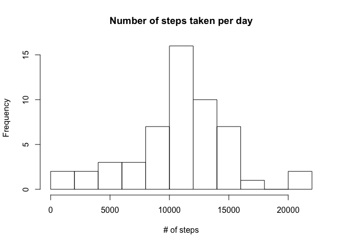

# Reproducible Research - Week 2 Assignment
Shilpa  
May 28, 2017  

This R Markdown file takes you through the steps to complete week 2 peer graded assignment for Reproducible Research course.

To start, set the working directory in the R studio to where you have placed the file 'activity.csv'. Below are the code for reading in the dataset and to look at summary of the dataset. 


```r
activity_data<-read.csv("activity.csv")
summary(activity_data)
```

```
##      steps                date          interval     
##  Min.   :  0.00   2012-10-01:  288   Min.   :   0.0  
##  1st Qu.:  0.00   2012-10-02:  288   1st Qu.: 588.8  
##  Median :  0.00   2012-10-03:  288   Median :1177.5  
##  Mean   : 37.38   2012-10-04:  288   Mean   :1177.5  
##  3rd Qu.: 12.00   2012-10-05:  288   3rd Qu.:1766.2  
##  Max.   :806.00   2012-10-06:  288   Max.   :2355.0  
##  NA's   :2304     (Other)   :15840
```

## What is mean total number of steps taken per day?

Below code does the following three calculations/plots:  
1. calculate daywise number of steps and store it in the file 'sum_activity_daywise'.  
2. create histogram for number of steps taken each day   
3. mean and median of the total number of steps taken per day  


```r
sum_activity_daywise<-aggregate(steps ~ date, activity_data,sum,na.rm=TRUE)

hist(sum_activity_daywise$steps,breaks=10,main="Number of steps taken per day",xlab="# of steps")
```

<!-- -->

```r
mean_activity <-mean(sum_activity_daywise$steps, na.rm=TRUE)

mean_activity
```

```
## [1] 10766.19
```

```r
median_activity <-median(sum_activity_daywise$steps, na.rm=TRUE)

median_activity
```

```
## [1] 10765
```
## What is the average daily activity pattern?

Below code does the following two calculations/plots:  
1. time series plot of the 5-minute interval (x-axis) and the average number of steps taken, averaged across all days (y-axis)  
2. the 5-minute interval that, on average, contains the maximum number of steps   


```r
avg_activity_intervalwise<-aggregate(steps ~ interval, activity_data, mean,na.rm=TRUE)
library(ggplot2)
ggplot(avg_activity_intervalwise, aes(interval, steps)) + geom_line()+labs(title="Average number of steps taken by interval")
```

<!-- -->

```r
max_step_interval<-avg_activity_intervalwise[which.max(avg_activity_intervalwise[,2]),][1]

max_step_interval
```

```
##     interval
## 104      835
```

## Imputing missing values

Below code does the following five calculations/plots:  

1. Calculate total number of missing values in the dataset 
2. Fill in the missing values in the dataset using the median for that day
3. Create a new dataset that is equal to the original dataset but with the missing data filled in.
4. Histogram of the total number of steps taken each day and Calculate and report the mean and median total number of steps taken per day. 
5. Impact of imputing missing data


```r
#count number of missing values  
na_count<-sum(is.na(activity_data$steps))
na_count
```

```
## [1] 2304
```

```r
# Fill in the missing values in the dataset using the median for that day  
median_activity_intervalwise<-avg_activity_intervalwise[,2]
activity_data_new<-cbind(activity_data,median_activity_intervalwise)

indx <- which(is.na(activity_data_new$steps), arr.ind = TRUE)

steps_modified <- with(activity_data_new, replace(steps, indx, median_activity_intervalwise))

#Create a new dataset that is equal to the original dataset but with the missing data filled in  

activity_data_modified <- cbind(activity_data_new,steps_modified)[,-c(1,4)]
summary(activity_data_modified)
```

```
##          date          interval      steps_modified  
##  2012-10-01:  288   Min.   :   0.0   Min.   :  0.00  
##  2012-10-02:  288   1st Qu.: 588.8   1st Qu.:  0.00  
##  2012-10-03:  288   Median :1177.5   Median :  0.00  
##  2012-10-04:  288   Mean   :1177.5   Mean   : 37.38  
##  2012-10-05:  288   3rd Qu.:1766.2   3rd Qu.: 27.00  
##  2012-10-06:  288   Max.   :2355.0   Max.   :806.00  
##  (Other)   :15840
```

```r
sum_activity_daywise_modified<-aggregate(steps_modified ~ date, activity_data_modified,sum,na.rm=TRUE)

# Histogram of the total number of steps taken each day and Calculate and report the mean and median total number of steps taken per day   

hist(sum_activity_daywise_modified$steps_modified,breaks=10,main="Number of steps taken per day",xlab="# of steps")
```

<!-- -->

```r
mean_activity_modified <-mean(sum_activity_daywise_modified$steps_modified)

mean_activity_modified
```

```
## [1] 10766.19
```

```r
median_activity_modified <-median(sum_activity_daywise_modified$steps_modified)

median_activity_modified
```

```
## [1] 10766.19
```

```r
# Impact of imputing missing data  

impact_NAs = (sum(sum_activity_daywise_modified$steps_modified)-sum(sum_activity_daywise$steps))/sum(sum_activity_daywise$steps)

impact_NAs
```

```
## [1] 0.1509434
```

## Are there differences in activity patterns between weekdays and weekends?

Below code does the following two calculations/plots:  

1. new factor variable in the dataset with two levels – “weekday” and “weekend” 
2. Panel plot comparing the average number of steps taken per 5-minute interval across weekdays and weekends


```r
# Add new factor variable in the dataset with two levels – “weekday” and “weekend”   
weekdays_label <- c('Monday', 'Tuesday', 'Wednesday', 'Thursday', 'Friday')

col_week<-factor((weekdays(as.Date(activity_data_modified$date)) %in% weekdays_label), levels=c(FALSE, TRUE), labels=c('weekend', 'weekday'))

activity_data_weekwise <- cbind(activity_data_modified,col_week)

# Panel plot comparing the average number of steps taken per 5-minute interval across weekdays and weekends  

library(dplyr)
activity_data_final <- activity_data_weekwise %>%
    group_by(interval, col_week) %>% 
    summarise(steps_modified=mean(steps_modified))

library(ggplot2)
p<-ggplot(activity_data_final, aes(interval, steps_modified))+geom_line() 
p+facet_grid(col_week ~ .)+labs(title="Average number of steps taken by interval",x="number of steps")
```

<!-- -->
